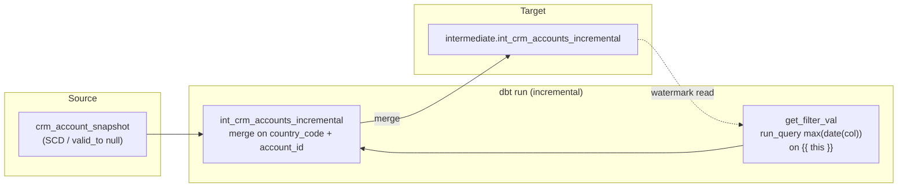
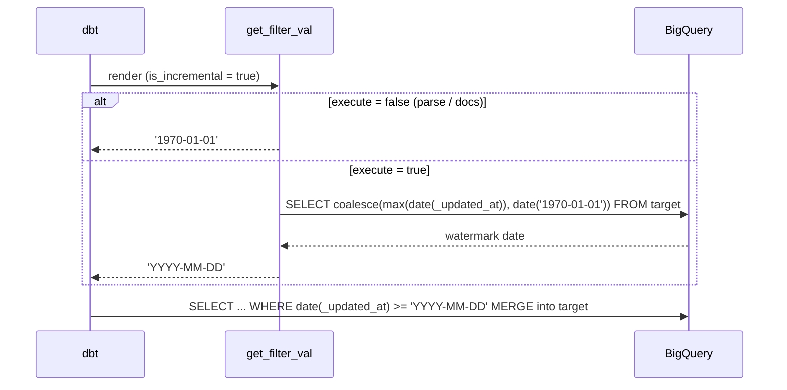

# Architecture — incremental filter macro

## Components

## Compile vs execute

## Design notes

- The macro does **not** own merge keys or SCD logic — only the watermark literal.
- Partition pruning still depends on the target being partitioned/clustered on
  something compatible with `_updated_at` or the merge key; the macro alone does
  not create partitions.
- Full refresh skips the macro path because `is_incremental()` is false.
