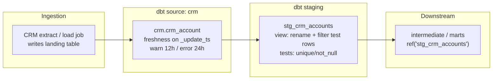
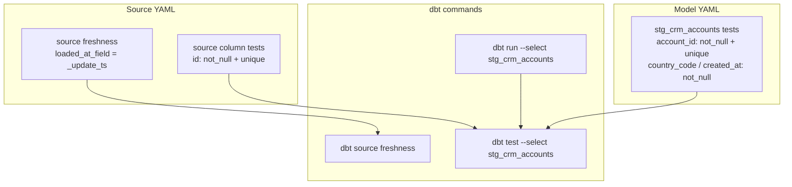

# Architecture — staging with tests and freshness

## Components

## Test and freshness placement

## Design notes

- Staging stays a **view** so it always mirrors the latest landing extract
  without storing a second full copy.
- Freshness lives on the **source**, not the model — it measures ingestion lag,
  not dbt run success.
- Model tests protect the **contract** downstream models rely on (key uniqueness
  after the test-data filter).
- Do not put enrichment joins here; that is the intermediate layer's job.
