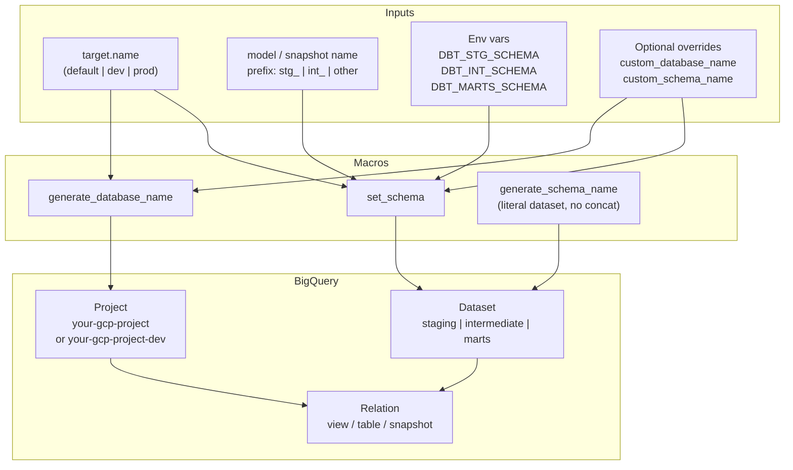
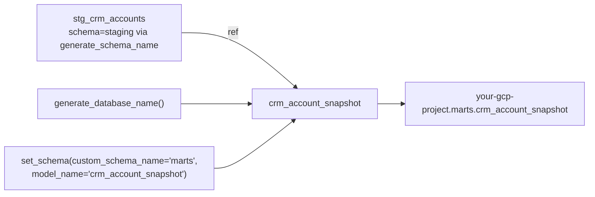

# Architecture — dataset / materialization routers

## Component view

## Snapshot wiring

## Design notes

- `set_schema` is for **explicit** configs (snapshots, rare one-offs). Day-to-day
  models usually rely on `dbt_project.yml` folder `+schema` plus the
  `generate_schema_name` override.
- Database routing and schema routing are intentionally separate macros so you
  can override one without the other.
- Prefix detection uses the first `_`-split token only (`stg_crm_accounts` →
  `stg`). Keep naming conventions boring.
