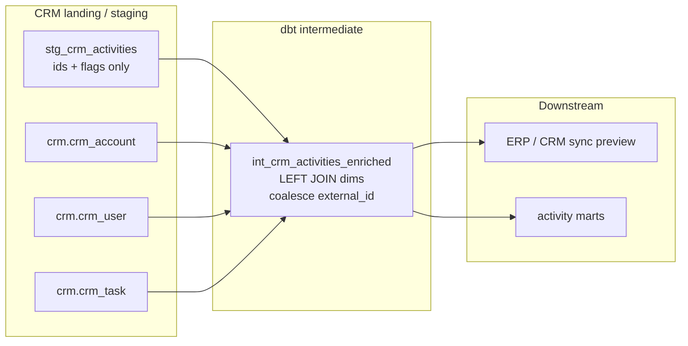
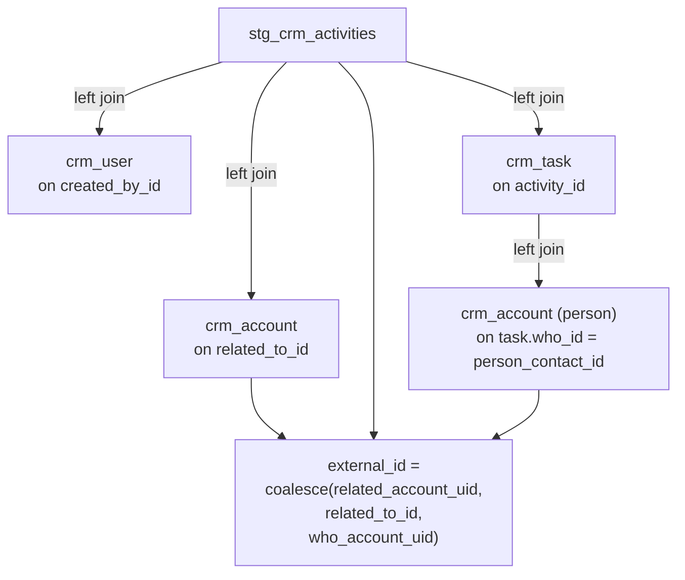

# Architecture — intermediate enrichment join

## Components

## Join topology

## Design notes

- **Left joins** preserve every activity row. Orphans show up as null
  `external_id` (warn-severity test) instead of silent row loss.
- **Fallback order** is intentional: prefer the stable account uid, then the
  raw related id, then the person-account path via task. Change that order in
  one model, not in five consumers.
- **Staging stays thin.** Body text and mailbox addresses are out of scope for
  this pattern; pull them from a restricted store only if a product feature
  truly needs them.
- Materialization is a **table** because enrichment is join-heavy and reused.
  Switch to a view only if the upstream dims are tiny and rebuild cost is
  negligible.
