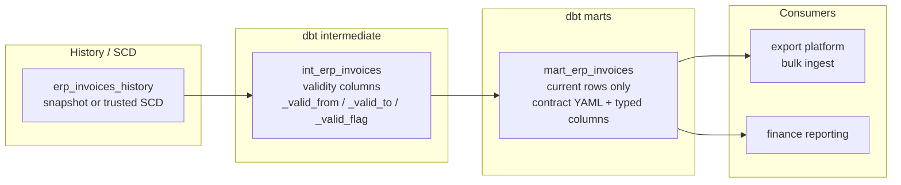
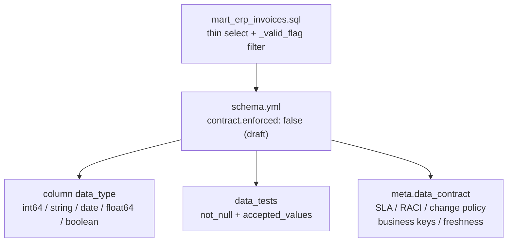

# Architecture — mart with model contract

## Components

## Contract surface

## Design notes

- **Mart stays thin.** History reshape and SCD flags belong in intermediate.
  The mart only publishes current rows consumers should see.
- **`enforced: false` first.** Draft contracts document intent without
  breaking builds on every type mismatch. Flip to `true` after a green
  `dbt build` window and consumer sign-off.
- **Accepted values are part of the API.** Payment status and move type enums
  fail tests when upstream invents new codes — better than silent filter
  drops in finance reports.
- **Meta is the human contract.** Ownership, SLA latency, and breaking-change
  notice days live beside the columns so wiki drift cannot diverge from the
  model that actually ships.
- Materialization is a **table** because export and BI both scan the current
  grain daily; a view over a heavy intermediate would re-pay the filter cost.
