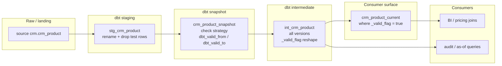
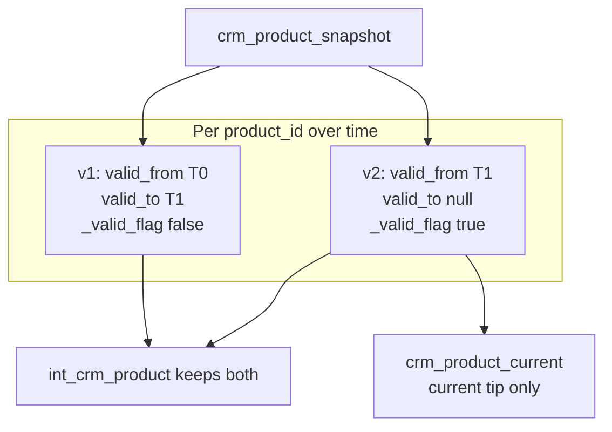

# Architecture — snapshot / SCD current-row filter

## Components

## SCD version windows

## Design notes

- **Staging stays dumb.** No SCD flags in staging — freshness and renames only.
- **Snapshot is the change detector.** `strategy='check'` + `check_cols='all'`
  is the right default for small catalogs; it is the wrong default for
  clickstream.
- **Intermediate keeps history.** Mapping `dbt_valid_to is null` →
  `_valid_flag` is fine; filtering those rows away here is not.
- **Current is a view by default.** Catalog tips are small; a view avoids a
  second storage copy. Materialize as a table only when scan cost or
  permission boundaries require it.
- **Tests encode grain.** Unique on `product_id` belongs on the current
  model, not on the intermediate history table.
