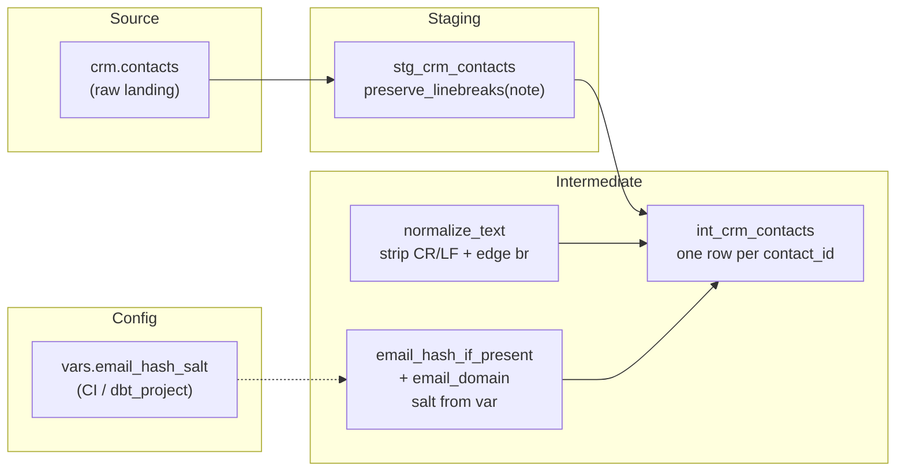

# Architecture — text-clean / normalize macros

## Components



## Staging vs intermediate contract

```mermaid
sequenceDiagram
  participant Raw as crm.contacts
  participant Stg as stg_crm_contacts
  participant Int as int_crm_contacts
  participant Cons as BI / joins

  Raw->>Stg: note with CR/LF, raw email
  Stg->>Stg: preserve_linebreaks(note)
  Note over Stg: email lowercased only
  Stg->>Int: note with br placeholders
  Int->>Int: normalize_text(note, status)
  Int->>Int: hash + domain; drop raw email
  Int->>Cons: email_hashed, email_domain, clean note
```

## Design notes

- Macros accept a column name (or a dotted / expression string for
  `normalize_text`). Pass the physical name for email helpers — they backtick
  the identifier.
- Mid-string `<br />` is intentional content and is **not** stripped.
- Salt default (`REPLACE_ME_SET_email_hash_salt`) is deliberately loud so a
  missing var fails the privacy review, not silently hashes with a shared
  placeholder in production.
- Dataset routers from pattern 03 are omitted so the text lesson stays
  visible; wire `generate_database_name` / `set_schema` if you already ship
  those macros.
