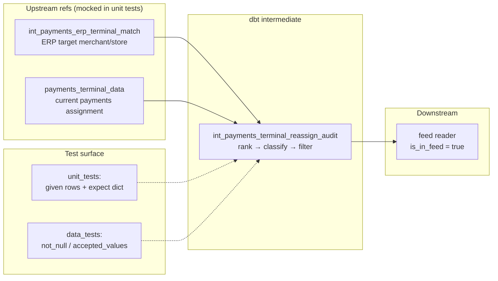
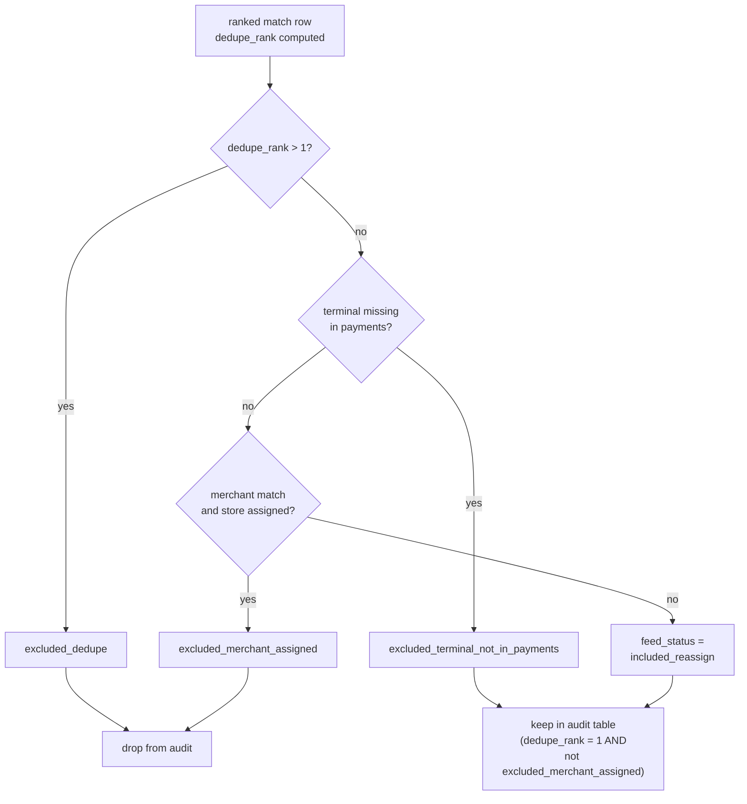

# Architecture — dbt model unit tests

## Components

## Classification branches

## Design notes

- **Unit tests mock refs, not sources.** The audit model only sees two
  upstream relations; fixtures stay small and readable.
- **Empty `expect.rows` is a first-class case.** Proving a row is *absent*
  (merchant already assigned) matters as much as proving include.
- **Partial expect rows are fine.** Assert the columns that encode the
  business rule; skip `evaluated_at` and other non-deterministic fields.
- **Stub upstream models exist only for the graph.** Their SQL is
  `where false` — production replaces them with real match / refined
  selects. Unit tests never execute the stub bodies.
- Materialize the audit as a **table** when an orchestrator polls it on a
  schedule; keep stubs as views.
