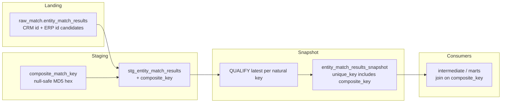
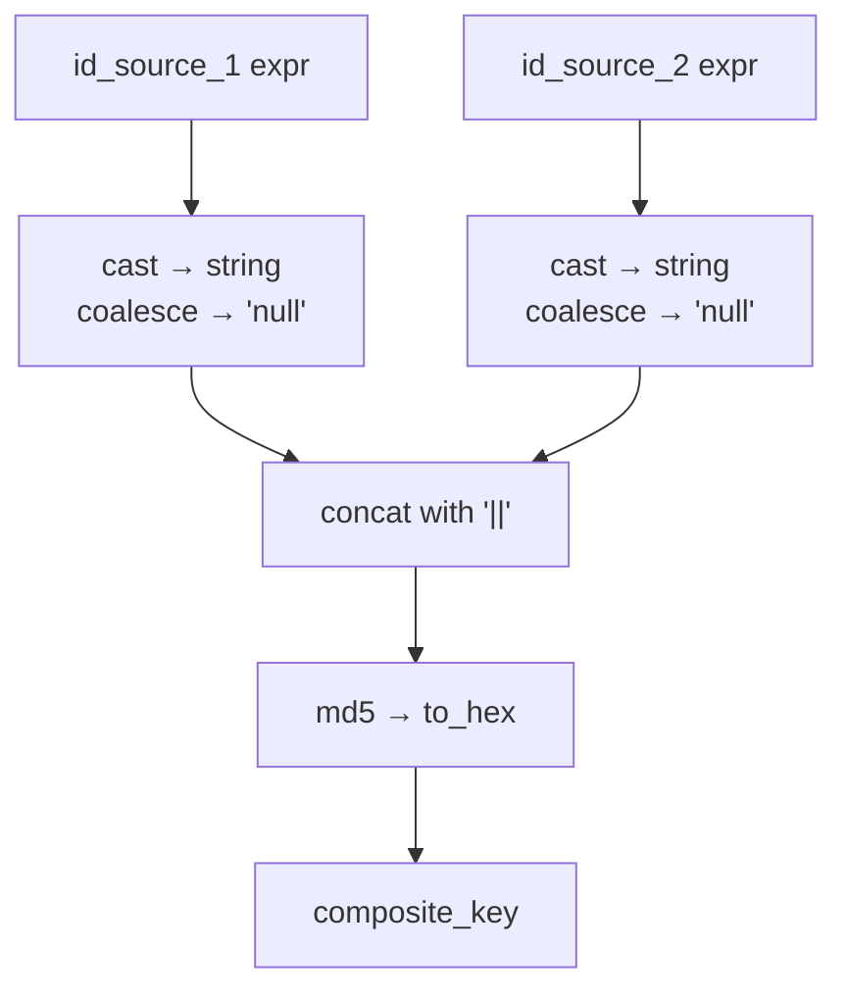
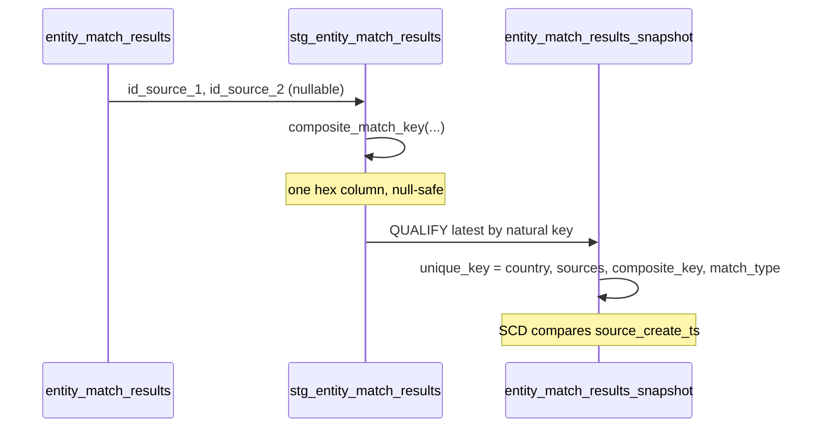

# Architecture — composite match-key macro

## Components

## Key composition

## Snapshot unique_key shape

## Design notes

- Macro arguments are **expressions** (column names or SQL fragments), not
  quoted identifiers — same call shape as production matching staging.
- Staging stays a view: cheap to recompute the hash; snapshot owns history.
- Do not put raw PII into the pair — ids only. Fuzzy scores travel as
  attributes, not as part of the key.
- Dataset routers from pattern 03 are omitted so the key lesson stays
  visible; wire them if your project already uses those macros.
