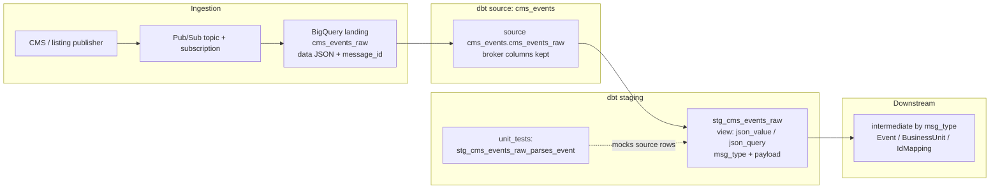
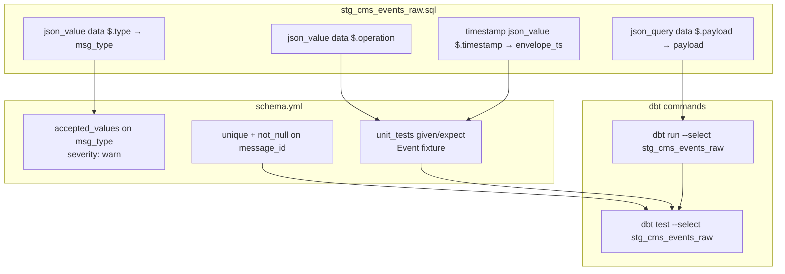

# Architecture — staging envelope parse with unit test

## Components

## Parse vs unit-test placement

## Design notes

- Staging is a **view** over the streaming landing table so parse logic
  always mirrors the latest subscription write without a second full copy.
- Unit tests prove the **JSON paths**, not grain. Keep `unique` / `not_null`
  on `message_id` for production load integrity.
- `accepted_values` on `msg_type` is **warn** so a new envelope type does not
  page the whole pipeline before intermediate models are ready.
- Do not unpack nested payload fields here; that is the typed intermediate
  layer's job after filtering on `msg_type`.
